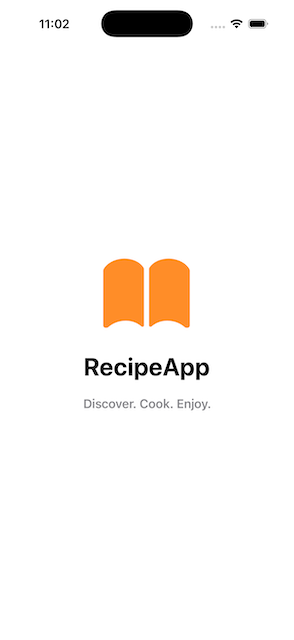
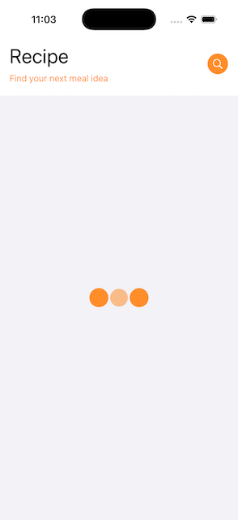
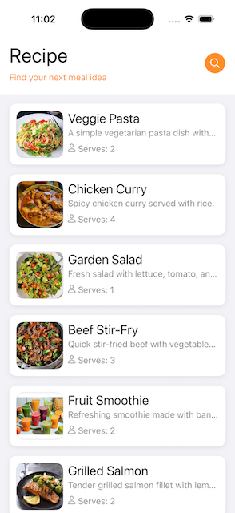
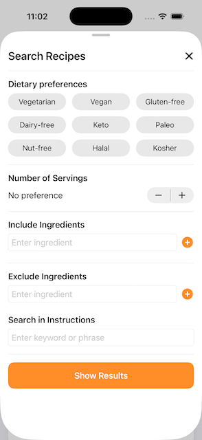
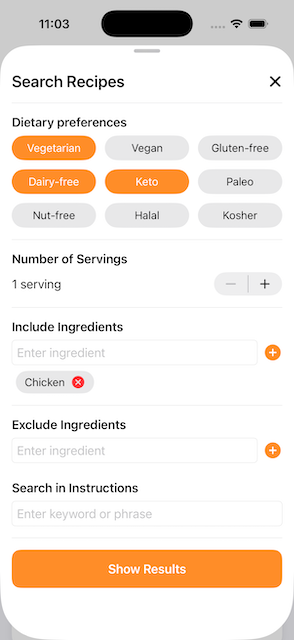
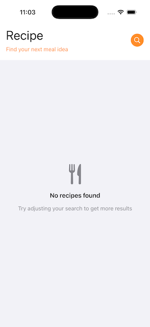
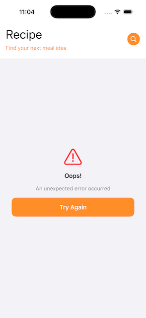

# FetchApp Documentation

## Setup Instructions

### Notes

The project is named FetchApp, but it is a Recipe app. I was aiming to build the fetch at the start and build the UI in another (what would be the actual Recipe app), but what happened is after building the fetch mechanism, I just continued working on this same project.

In general, the LocalRecipeDataService simulates what a backend endpoint would do. Our north star is that we would convert the `RecipeQuery` object into something that the BE can use (query parameters, body, etc) that we can include in the request, then we would get a filtered list of recipe in return.

Should look okay in both light and dark modes.

### Screenshots

| Screen                  | Screenshot                          |
|--------------------------|-------------------------------------|
| Launch                   |  |
| Loading                  |  |
| Home                     |  |
| Search (no parameters)   |  |
| Search                   |  |
| Empty                    |  |
| Error                    |  |


### Usage

After running the app, it should automatically fetch the data from a local json file. From the app's main interface, tapping the magnifying glass icon from the upper right corner should bring up the search filter view where you can specify search parameters. To reset the data, search without setting any parameters. The search uses AND logic.

All data is local, if using a real backend endpoint, the search should hit that endpoint. 

### Prerequisites
Note: The code was written in Xcode 16.2, but tested in iPhone simulators running iOS 26.

- Xcode 16.2 or later
- iOS 18.5+ deployment target
- Swift 5.0+

### Installation Steps

1. **Clone or download the project**   

2. **Open the project in Xcode**

3. **Install dependencies**

   Note: I didn't need a dependency for this project. But added and used one to fill a requirement.

   - The project uses Swift Package Manager
   - Dependencies will be resolved automatically when you open the project
   - Required package: [ActivityIndicatorView](https://github.com/exyte/ActivityIndicatorView.git) (v1.2.1)

4. **Build and run**
   - Select a target device or simulator (iPhone)
   - Press `Cmd + R` to build and run
   - Or use `Cmd + U` to run the test suite

### Tests

The project includes unit tests in `FetchAppTests`:
- `FetchAppTests/LocalRecipeDataServiceTests.swift` - Tests for data loading
- `FetchAppTests/RecipeFilterTests.swift` - Tests for search/filter logic

---

## High-Level Architecture Overview

### Architecture Pattern: MVVM (Model-View-ViewModel)

```
Views (SwiftUI Views - UI Layer)
 - HomeView, RecipeListView, RecipeDetailView
 - SearchSheetView, StateMessageView
                  │
                  ▼
ViewModels (Observable State Management)
 - ListContentViewModel
 - SearchSheetViewModel
                  │
                  ▼
Services (Data Layer - Protocol-based)
 - RecipeDataService (protocol)
 - LocalRecipeDataService (implementation)
                  │
                  ▼
Models (Data Models)
 - Recipe, DietaryAttribute, RecipeQuery
                  │
                  ▼
Utilities
 - RecipeFilter
```

### Key Components

#### 1. **Models** (`Models/`)
- `Models/Recipe.swift` - Core recipe data structure with `Decodable` support
- `Models/DietaryAttribute.swift` - Enum for dietary restrictions (vegetarian, vegan, gluten-free, etc.)
- `Models/RecipeQuery.swift` - Search/filter criteria model

#### 2. **Services** (`Services/`)
- `Services/RecipeDataService.swift` - Protocol defining data fetching contract
- `Services/LocalRecipeDataService.swift` - Implementation that loads from bundled JSON file

#### 3. **ViewModels** (`ViewModels/`)
- `ViewModels/ListContentViewModel.swift` - Manages recipe list state (loading, empty, data, error)
- `ViewModels/SearchSheetViewModel.swift` - Manages search filter state

#### 4. **Views** (`Views/`)
- `Views/HomeView.swift` - Main container with navigation
- `Views/RecipeListView.swift` - Displays recipe list with state management
- `Views/RecipeDetailView.swift` - Shows detailed recipe information
- `Views/Search/SearchSheetView.swift` - Advanced search/filter modal
- `Views/SplashView.swift` - Launch screen with animation

#### 5. **Utilities** (`Utilities/`)
- `Utilities/RecipeFilter.swift` - Pure function-based filtering logic

---

## Key Design Decisions

### 1. **Protocol-Oriented Architecture**
**Decision**: Use `RecipeDataService` protocol instead of concrete implementation.

**Rationale**:
- Enables easy swapping between local JSON and future remote API
- Facilitates unit testing with mock implementations

```swift
// Current: Local JSON
let service: RecipeDataService = LocalRecipeDataService()

// Future: Remote API
let service: RecipeDataService = RemoteRecipeDataService()
```

### 2. **State-Based UI with Enums**
**Decision**: Use enum-based state management in `ListContentViewModel`.

```swift
enum State {
    case initial
    case loading
    case empty
    case data([Recipe])
    case error(Error)
}
```

- Makes all possible states explicit
- Compiler-enforced exhaustive handling
- Clear separation of concerns (UI reflects state)

### 3. **Separation of Filtering Logic**
**Decision**: Extract filtering into `RecipeFilter` utility class.

(Please see note above in the first section as to why we need this)

- Pure function approach (no side effects)
- Highly testable in isolation (see `FetchAppTests/RecipeFilterTests.swift`)
- Reusable across different data sources
- Service layer remains focused on data fetching

### 4. **SwiftUI Observable Macro**
This app uses the `@Observable` macro instead of `ObservableObject`.

- Modern Swift concurrency approach
- Cleaner syntax and less boilerplate

### 5. **Async/Await for Data Loading**
**Decision**: Use `async/await` in `LocalRecipeDataService`.

```swift
func fetchRecipes(query: RecipeQuery?) async throws -> [Recipe]
```

- Native Swift concurrency (no Combine/closures)
- Better error handling with structured concurrency
- Easier to read and maintain
- Prepares codebase for async network calls

---

## Assumptions and Tradeoffs

### Assumptions

1. **Data Structure Consistency**
   - All recipes in JSON follow the same schema
   - Invalid data is caught during decoding phase

2. **Bundle Resources**
   - All necessary data are stored locally. It is assumed that the `RecipeImageView` can handle remote images, but it has not been tested as of now.

3. **Search Behavior**
   - Text search is case-insensitive
   - Multiple dietary attributes use AND logic (recipe must match ALL)

### Tradeoffs

#### 1. **Image Storage**
**Current**: Asset catalog with local images  
**Tradeoff**:
- **Pros**: Fast loading, works offline, optimized by Xcode
- **Cons**: Increases app size, can't update without app release

**Improvement**: `RecipeImageView` supports remote URLs for future hybrid approach (see note in Bundle Resources)

#### 2. **Filtering Strategy**
In-memory filtering on client side to simulate a server doing thay job

#### 3. **Testing Strategy**
**Current**: Unit tests for critical paths (data loading, filtering) have been added, but not for everything. UI tests haven't been added yet as well.

---

## Contact & Support

Please contact johnlee.programming@gmail.com
